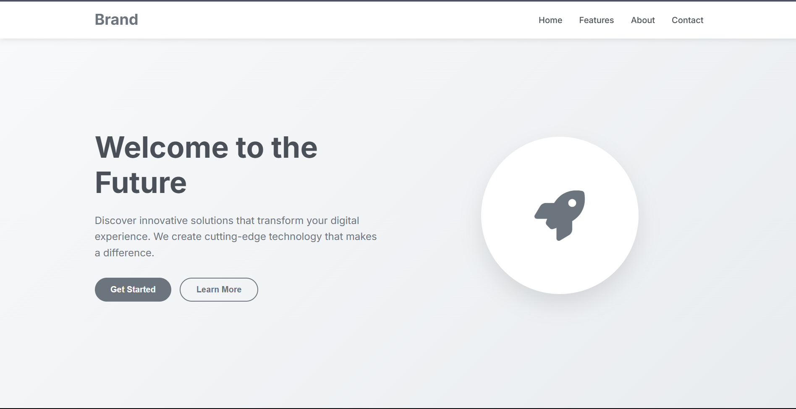

# 🚀 Landing Page

Welcome to the **Landing Page** repository! This is a sleek and responsive landing page designed using modern web technologies. It's perfect for product showcases, portfolio intros, or upcoming event announcements.

## 🌐 Live Preview

🔗 [View Live Site](https://taniyya.github.io/landing-page/)

## 📸 Screenshots



## 🛠 Tech Stack

- HTML5
- CSS3
- JavaScript
- [Font Awesome](https://fontawesome.com/)

## 📁 Folder Structure
```
landing-page/
│
├── style.css/ # Stylesheets
├── script.js/ # JavaScript functionality
├── index.html # Main HTML file
└── README.md # Project info
```

## 🚧 Features

- Fully responsive design
- Clean and modern layout
- Interactive sections
- Smooth scrolling effects

## 🧑‍💻 Contributing

We welcome contributions! Please read our [Contributing Guidelines](CONTRIBUTING.md) before submitting a pull request.

## 📄 License

This project is open-source under the [MIT License](LICENSE).

---

Made with ❤️ by [Sumangal Karan](https://github.com/Sumangal44)


